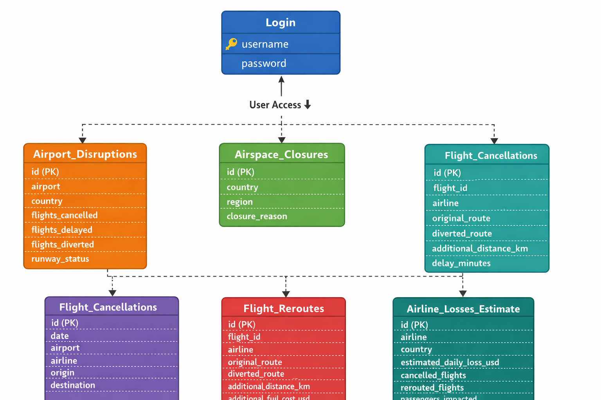

# Distributed Aviation Disruption Analytics System: Database

## Overview

This document describes the database schema used in the Distributed Aviation Disruption Analytics System.
The database **aviationDB** needs to be created using MySQL and supports data ingestion from CSV datasets uploaded by the client application (AviationClientApp).

* **aviationDB** Database:
The database contains the following tables:
1. login
2. airline_losses_estimate
3. airport_disruptions
4. airspace_closures
5. flight_cancellations
6. flight_reroutes

## 1. Login Table

**Purpose**

* The login table stores authentication credentials for admin users (AviationClientApp) who access the server system (AviationServerApp).

**Table Structure**
 
| Column	| Data Type |	Description |
| --------- | ----------------- | -------------------------------- |
| username	| VARCHAR(60)	| Unique username for system login |
| password	| VARCHAR(60)	| User password | 

## 2. Airline Losses Estimate Table

**Purpose** 

* The **airline_losses_estimate** table stores estimated financial and operational losses experienced by airlines during aviation disruptions.

* The data is typically **imported from CSV datasets uploaded by the client application**.

**Table Structure**

| Column	| Data Type	| Description |
| --------- | ----------------- | -------------------------------- |
| airline	| VARCHAR(100)	| Airline company name |
| country	| VARCHAR(100)	| Country where the airline operates |
| estimated_daily_loss_usd |	DOUBLE	| Estimated daily financial loss in USD |
| cancelled_flights	| INT	| Number of flights cancelled |
| rerouted_flights	| INT	| Number of flights rerouted |
| passengers_impacted	| INT	 | Number of passengers affected |

## 3. Airport Disruptions Table

**Purpose**

* The **airport_disruptions** table stores operational disruption data for airports, including flight cancellations, delays, diversions, and runway status.

* This information helps analyze airport-level disruptions caused by weather events, volcanic eruptions, strikes, or geopolitical restrictions.

**Table Structure**

| Column	| Data Type	| Description |
| --------- | ----------------- | -------------------------------- |
| airport	| VARCHAR(100)	| Name of the airport |
| country	| VARCHAR(100)	| Country where the airport is located |
| flights_cancelled	| INT	| Number of flights cancelled |
| flights_delayed	| INT	| Number of flights delayed |
| flights_diverted	| INT	| Number of flights diverted |
| runway_status |	VARCHAR(100)	| Operational status of runway |

## 4. Airspace Closures Table

**Purpose**

* The **airspace_closures** table records temporary airspace restrictions or closures affecting airline routes.

* Closures may occur due to:
  - Military conflicts
  - Volcanic eruptions
  - Severe weather
  - Government regulations

**Table Structure**

| Column	| Data Type	| Description |
| --------- | ----------------- | -------------------------------- |
| country	| VARCHAR(100)	| Country where airspace is closed |
| region	| VARCHAR(100)	| Specific region affected |
| closure_reason |	VARCHAR(255)	| Reason for airspace closure |

## 5. Flight Cancellations Table

**Purpose**

* The **flight_cancellations** table records individual flight cancellations, allowing the system to track disruptions over time.

* This table is useful for temporal analysis of aviation disruptions.

**Table Structure**
| Column	| Data Type	| Description |
| --------- | ----------------- | -------------------------------- |
| date |	DATE |	Date of flight cancellation |
| airport	| VARCHAR(100)	| Airport where cancellation occurred |
| airline	| VARCHAR(100)	| Airline operating the flight |
| origin	| VARCHAR(100)	| Departure airport |
| destination	| VARCHAR(100)	| Destination airport |
| cancellation_reason	| VARCHAR(255) |	Reason for cancellation |

## 6. Flight Reroutes Table

**Purpose**

* The flight_reroutes table stores information about flights that were diverted or rerouted due to disruptions.

* This data helps estimate:
  - Additional distance traveled
  - Increased fuel costs
  - Flight delays

**Table Structure**
| Column	| Data Type	| Description |
| --------- | ----------------- | -------------------------------- |
| flight_id	| VARCHAR(100) |	Unique | identifier of the flight |
| airline	| VARCHAR(100) |	Airline | operating the flight |
| original_route |	VARCHAR(255)	| Planned flight route |
| diverted_route	| VARCHAR(255)	| Actual diverted route |
| additional_distance_km |	DOUBLE	| Extra distance flown due to diversion |
| additional_fuel_cost_usd |	DOUBLE	| Additional fuel cost incurred | 
| delay_minutes |	INT |	Delay caused by rerouting |

